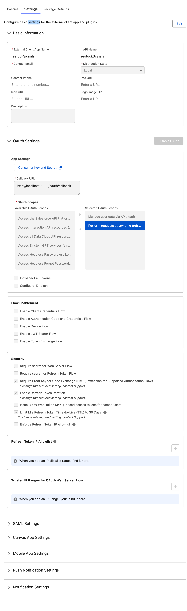
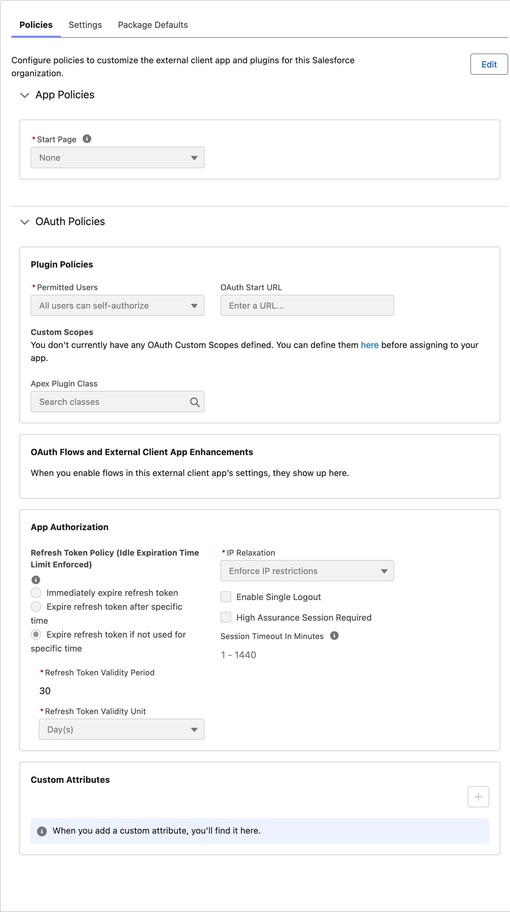

# Salesforce OAuth Web

This project creates an OkHttp client authenticated against Salesforce with the OAuth 2.0 authorization-code flow, PKCE, a localhost callback, and refresh-token rotation support.

The first request to the configured Salesforce origin opens the browser and obtains access and refresh tokens. Later `401` responses use the refresh token. If refreshing fails, the browser authorization flow starts again. Tokens are kept in memory, so restarting the application also requires browser authorization.

## Requirements

- JDK 26, as configured in `pom.xml`.
- A Salesforce External Client App with OAuth enabled.
- The External Client App's Consumer Key, used as `SALESFORCE_CLIENT_ID`.
- A Salesforce My Domain origin, used as `SALESFORCE_DOMAIN`, for example `https://example.my.salesforce.com`.
- Port `8999` available on localhost while browser authorization is in progress.

The example application configuration can be supplied with:

```shell
export SALESFORCE_CLIENT_ID='your-consumer-key'
export SALESFORCE_DOMAIN='https://example.my.salesforce.com'
export SALESFORCE_API_VERSION='v66.0'
```

## Required External Client App settings

These values must match the current implementation.

| Salesforce setting | Required value | Reason |
| --- | --- | --- |
| OAuth | Enabled | The client uses Salesforce OAuth endpoints. |
| Callback URL | `http://localhost:8999/oauth/callback` | Salesforce requires an exact match with the redirect URI sent by the client. |
| OAuth scope | **Manage user data via APIs (`api`)** | The client requests the `api` scope for Salesforce API calls. |
| OAuth scope | **Perform requests at any time (`refresh_token`, `offline_access`)** | Salesforce must issue a refresh token. `refresh_token` and `offline_access` are synonymous; the client requests `refresh_token`. |
| Require secret for Web Server Flow | Disabled | This is a local public client and sends no client secret during the authorization-code exchange. |
| Require secret for Refresh Token Flow | Disabled | Refresh requests contain the client ID and refresh token, but no client secret. |

If Salesforce does not return a refresh token, authentication fails with `Salesforce token response has no refresh_token`.

The selected callback and scopes in the Settings screenshot below are correct.

The selected **Distribution State: Local** is appropriate when the app is only used in this Salesforce organization. The app name, API name, contact details, description, logo, and information URL do not affect this OAuth client.

## Reference configuration screenshots

### Settings tab

This screenshot contains the External Client App's global definition: basic information, callback URL, OAuth scopes, optional flow enablement, security controls, refresh-token IP allowlist, and trusted IP ranges.

<a href="screenshot_external_client_app_settings.png">
  
</a>

### Policies tab

This screenshot contains the policies applied in the Salesforce organization: permitted users, optional plugin policies, refresh-token expiration, IP relaxation, single logout, high assurance, and session timeout.

<a href="screenshot_external_client_app_policies.png">
  
</a>

## Recommended settings

### Require PKCE

Keep **Require Proof Key for Code Exchange (PKCE)** enabled. The client generates a new verifier and SHA-256 challenge for every browser authorization. PKCE protects the authorization code without requiring a client secret. Salesforce also recommends PKCE for public clients.

### Enable Refresh Token Rotation

Keep **Enable Refresh Token Rotation** enabled. Each successful refresh returns a replacement refresh token and invalidates the one just used. The client stores the replacement before the next refresh and serializes concurrent authentication attempts so that it does not submit the same refresh token simultaneously.

If a refresh token is expired, revoked, already rotated, or otherwise rejected, the client immediately starts a new browser authorization.

### Limit idle refresh-token TTL to 30 days

Keeping **Limit Idle Refresh Token Time-to-Live (TTL) to 30 Days** enabled is a reasonable security setting. The policy shown in the screenshot, **Expire refresh token if not used for specific time: 30 days**, uses a sliding window. Each successful refresh resets the idle period.

The client refreshes only in response to a Salesforce API `401`; it does not run a background refresh timer. Therefore:

- Regular use normally keeps the refresh-token chain active.
- After more than 30 days without a refresh, the next refresh fails and browser authorization starts again.
- The application does not remain fully unattended after a 30-day idle period because a user must complete that browser authorization.

### Permitted Users

The selected **All users can self-authorize** policy is convenient for local development. For a controlled or production environment, prefer **Admin-approved users are pre-authorized** and grant access through a dedicated permission set. Changing this policy can revoke existing authorization and require users to authenticate again.

### IP restrictions

The selected **IP Relaxation: Enforce IP restrictions** is a secure default when the user's profile or organization has appropriate trusted IP ranges. It can block the app when a laptop moves between networks or uses an unlisted public IP.

**Enforce Refresh Token IP Allowlist** is optional. Enable it only when the application has predictable public egress addresses, and add those addresses to the Refresh Token IP Allowlist first. Requests outside that allowlist are blocked rather than challenged.

The **Trusted IP Ranges for OAuth Web Server Flow** list is not required by this client. Configure it only as part of an intentional organization-wide IP policy.

### High assurance

**High Assurance Session Required** is optional. Enable it when access to the permitted Salesforce data should require a high-assurance session, normally backed by MFA. It can add an authentication challenge or block users who cannot establish that session level.

## Settings not used by this project

The following settings can remain disabled or empty:

- Introspect All Tokens
- Configure ID Token
- Enable Client Credentials Flow
- Enable Authorization Code and Credentials Flow
- Enable Device Flow
- Enable JWT Bearer Flow
- Enable Token Exchange Flow
- Issue JWT-based access tokens for named users
- OAuth Start URL
- Apex Plugin Class and custom scopes
- Enable Single Logout
- SAML, Canvas, Mobile, Push Notification, and Notification settings

Despite the similar name, Salesforce's **Authorization Code and Credentials Flow** toggle is for its Headless Identity flow. This project uses the standard OAuth web-server authorization-code grant with PKCE and does not need that toggle.

The **Start Page** can remain `None`. Session timeout can remain at the organization default; when an access token expires and Salesforce returns `401`, the client uses its refresh token.

## Token and heap-dump security

Access and refresh tokens are held only in memory and are replaced when Salesforce rotates them. They are not persisted by this project. However, active tokens and immutable `String` objects that have not yet been garbage-collected can appear in a JVM heap dump.

For a deployment where heap dumps are considered a credential-exposure risk:

- Do not enable `-XX:+HeapDumpOnOutOfMemoryError`; automatic out-of-memory heap dumps are disabled by default.
- Start the application with `-XX:+DisableAttachMechanism` if operational tooling such as `jcmd`, `jmap`, and `jstack` is not required. This prevents those tools from attaching to the JVM and requesting a heap dump.
- Restrict operating-system access to the application process and treat any deliberately collected heap dump as a secret containing credentials.

## Relevant Salesforce documentation

- [OAuth tokens and scopes](https://help.salesforce.com/s/articleView?id=sf.remoteaccess_oauth_tokens_scopes.htm&language=en_US&type=5)
- [OAuth web-server flow with PKCE](https://help.salesforce.com/s/articleView?id=xcloud.remoteaccess_oauth_web_server_flow.htm&language=en_US&type=5)
- [Refresh-token flow](https://help.salesforce.com/s/articleView?id=xcloud.remoteaccess_oauth_refresh_token_flow_ca.htm&language=en_US&type=5)
- [Configure External Client App OAuth settings](https://help.salesforce.com/s/articleView?id=sf.configure_external_client_app_oauth_settings.htm&language=en_US)
- [Refresh-token IP allowlist](https://help.salesforce.com/s/articleView?id=xcloud.set_ip_allowlist_for_refresh_tokens.htm&language=en_US&type=5)
- [Preauthorize users](https://help.salesforce.com/s/articleView?id=xcloud.preauth_user_app_access_through_eca.htm&language=en_US&type=5)

Relevant Java documentation:

- [Java 25 serviceability and heap-dump options](https://docs.oracle.com/en/java/javase/25/docs/specs/man/java.html)
